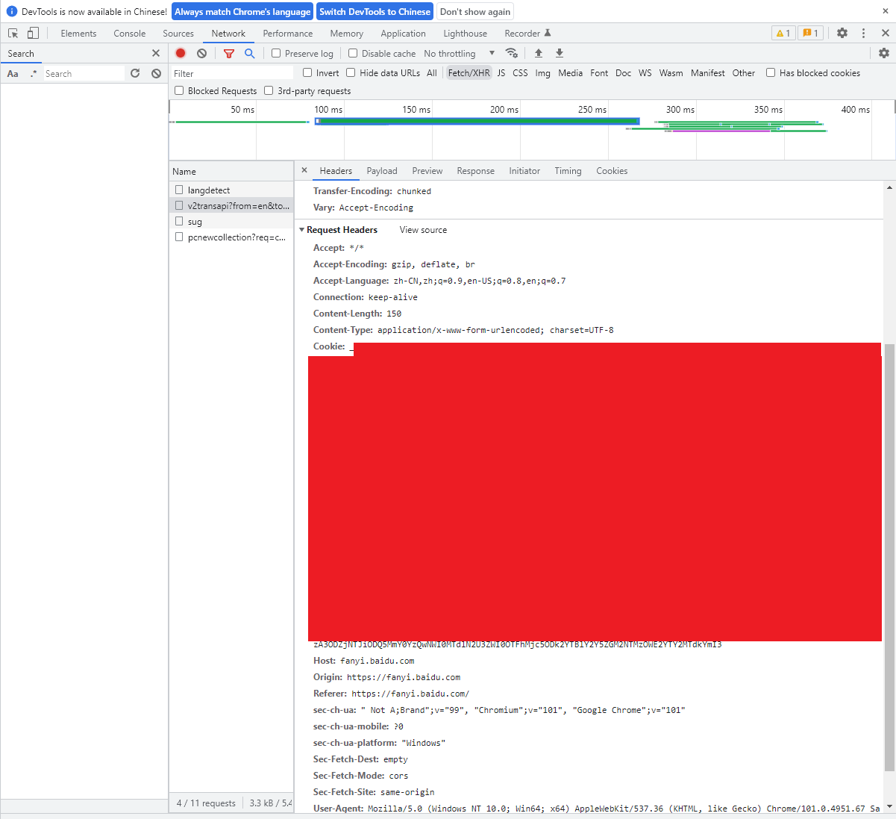
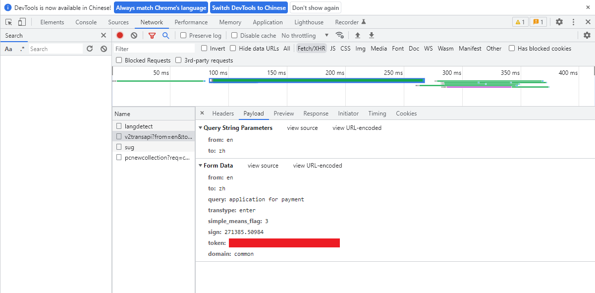

# Translator-baidu

> **## 参考资料：**
>
> [pandas 读取excel、一次性写入多个sheet、原有文件追加sheet](https://blog.csdn.net/qq_35318838/article/details/104692846)
> [Pandas 获取EXCEL 各sheet name和内容的两种方法](https://blog.csdn.net/qq_35499652/article/details/120703525)
> [python入门-爬取百度翻译中的双语例句](https://www.jianshu.com/p/92478814d217)
> [python爬虫高级教程，JS逆向之百度翻译](https://blog.csdn.net/Python_sn/article/details/109730791)


## 功能

- **使用百度翻译，批量获取中文释义，双语例句**
- `getTranslationFromTo.py` 可以指定输入与输出的语言进行翻译，仅**输出翻译结果** （使用方法同`getTranslation.py` ，且以下仅介绍`getTranslation.py` ）
  
- `getTranslation.py`  可以批量翻译指定单词（短语）的**中文意思、双语例句**


- [x] 已完成

  - 从excel文件中，读取待翻译的单词（短语），利用百度翻译，得到中文意思

  - 同时得到双语例句，大部分单词（短语），都可以得到很多例句

  - 最终双语例句，仅保留一个中文，一个英文

- [ ] 待完成
  - 极少部分的单词（短语）没有例句，
  - 极少部分的单词（短语）同时也没有中文翻译
  - 输出的excel表格文件，打开后会提示有错误（office365 2022/05/29最新版），但是最终结果没有问题


## 输出

- `trans_res.xlsx`文件

- 示例：

  | Term                    | 中文翻译     | 英文例句                                                     | 中文例句                                                     |
  | ----------------------- | ------------ | ------------------------------------------------------------ | ------------------------------------------------------------ |
  | adult training program  | 成人培训计划 |                                                              |                                                              |
  | application for payment | 付款申请书   | Much to my regret that we have made repeated application for payment of  this amount without avail. | 我们多次去函请求结清这笔账款而无任何结果，为此我们非常遗憾。 |
  | capable of undertaking  | 能够承担     | All of this ensures that SEAL members are physically and mentally as  tough as nails and capable of undertaking the most difficult operations in  the world , wherever that may be. | 所有的训练确保了海豹突击队员拥有如钉子一般坚韧的身心，无论在世界的任何地方都能够承担起最困难的任务。 |
  | dismissal               | 解雇         | Her dismissal came as a bolt from the blue.                  | 她被解雇简直就是晴天霹雳。                                   |
  | to be laid off          | 被解雇       | He certainly did not expect to be laid off especially so soon after  graduation. | 他从来没有料到毕业后那么快被解雇。                           |


## 使用说明

1. 下载代码

   ```cmd
   git clone git@github.com:hongtao45/Translator-baidu.git
   ```

   

2. 安装依赖库

   ```spython
   pip install PyExecJS
   pip install tqdm
   pip intsll pandass
   ```

   

3. 设置cookie

   - `getTranslation.py`中的请求头（headers）非常重要，在请求 fanyi.baidu.com 这个页面的时候需要传递

   - Cookie 每段时间都会变化；998、997 这些错误代码跟 Cookie 有关

   - 现在直接有的cookie已经可直接用一段时间，但使用一段时间后，输出结果都是空的，这个时候就需要配置自己的cookie了
   - 如何获取cookie详见[如何获取cookie](##如何获取cookie)，获取后将headers中的"Cookie"替换成真实的cookie即可

   

4. 修改自己待翻译文件的位置

   `main.py`文件中的 words 为待翻译的文件

   `main.py`文件中的 result 为保存翻译结果的文件

   

5. 运行`main.py`文件

   ```python
   python main.py
   ```


## 如何获取cookie

1. 用Chrome打开 https://fanyi.baidu.com/

2. 随便输入一段需要翻译的文字。当翻译结果出来的时候，按下F12，

3. 选择到NETWORK，再点进Fetch/XHR文件

4. 一个以v2transapi?开头的文件，它就是我们要找的api接口。验证：点进去文件-preview，我们就可以在json格式的数据里面找到翻译结果，验证成功。

5. 回到Header中，既可以看到cookie和token的位置如下：

   cookie位置：

   

   token位置（Rayload页面中）：

   

6. 复制cookie，到代码`getTranslation.py`中的请求头（headers）中替换即可

7. token已添加，使用正则表达表示自动获取了，**可以不用指定**

   
  
  

## 语言英文缩写对应表

在使用`getTranslationFromTo.py` 过程中，输入输出语言的指定写法如下


```text
 'zh': '中文','jp': '日语','jpka': '日语假名','th': '泰语','fra': '法语',
 'en': '英语','spa': '西班牙语','kor': '韩语','tr': '土耳其语',
 'vie': '越南语','ms': '马来语','de': '德语','ru': '俄语','ir': '伊朗语',
 'ara': '阿拉伯语','est': '爱沙尼亚语','be': '白俄罗斯语','bul': '保加利亚语',
 'hi': '印地语','is': '冰岛语','pl': '波兰语','fa': '波斯语','dan': '丹麦语',
 'tl': '菲律宾语','fin': '芬兰语','nl': '荷兰语','ca': '加泰罗尼亚语',
 'cs': '捷克语','hr': '克罗地亚语','lv': '拉脱维亚语','lt': '立陶宛语',
 'rom': '罗马尼亚语','af': '南非语','no': '挪威语','pt_BR': '巴西语',
 'pt': '葡萄牙语','swe': '瑞典语','sr': '塞尔维亚语','eo': '世界语',
 'sk': '斯洛伐克语','slo': '斯洛文尼亚语','sw': '斯瓦希里语','uk': '乌克兰语',
 'iw': '希伯来语','el': '希腊语','hu': '匈牙利语','hy': '亚美尼亚语',
 'it': '意大利语','id': '印尼语','sq': '阿尔巴尼亚语','am': '阿姆哈拉语',
 'as': '阿萨姆语','az': '阿塞拜疆语','eu': '巴斯克语','bn': '孟加拉语',
 'bs': '波斯尼亚语','gl': '加利西亚语','ka': '格鲁吉亚语','gu': '古吉拉特语',
 'ha': '豪萨语','ig': '伊博语','iu': '因纽特语','ga': '爱尔兰语','zu': '祖鲁语',
 'kn': '卡纳达语','kk': '哈萨克语','ky': '吉尔吉斯语','lb': '卢森堡语',
 'mk': '马其顿语','mt': '马耳他语','mi': '毛利语','mr': '马拉提语',
 'ne': '尼泊尔语','or': '奥利亚语','pa': '旁遮普语','qu': '凯楚亚语',
 'tn': '塞茨瓦纳语','si': '僧加罗语','ta': '泰米尔语','tt': '塔塔尔语',
 'te': '泰卢固语','ur': '乌尔都语','uz': '乌兹别克语','cy': '威尔士语',
 'yo': '约鲁巴语','yue': '粤语','wyw': '文言文','cht': '中文繁体'
```


